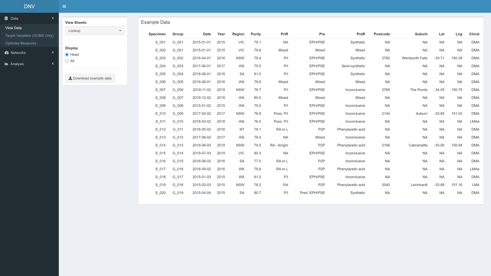

# Dynamic Network Visualisation (DNV) 
The DNV is an interactive R Shiny web application for visualising and analysing patterns in illicit drug markets to provide insights in line with an intelligence-led policing approach. The app has a dashboard layout with sections for viewing and optimising data, building network graphs and provide knowldege regarding relational, temporal, spatial and other quantitative analyses. 

*Note: As the original dataset used in this project is sensitive, a simulated dataset has been created for this example.*

## Significance
Currently, the types of visualisations created to support intelligence-led policing are static in nature [39, 102]; limiting the potential of the available information. To create actionable intelligence, it is important that drug markets and their features can be viewed in an interactive and dynamic way.

## Shinyapps.io hosting
The DNV app can be accesses at https://popovicana.shinyapps.io/Dynamic-Network-Visualisation/

## Usage

### View Data page
The "View Data" page is the first thing you see when the app is loaded. Here you can explore the simulated dataset

### Target Variables page
This page allows you to reduce any redundant variables in the GCMS dataset.

### Optimise Measures page

### Plots page

### Summary page

### Relational Analysis page

### Temporal Analysis page

### Spatial Analysis page

### Quantitative Analysis page

## Future direction
Still not finished :O 

## Author 
Ana Popovic - [popovicana](https://github.com/PopovicAna)

## Licence

## Acknowledgements
This project is part of a Australian Research Council grant (number.)

This application would not be possible without key packages by other authors in the R community, particularly the shiny, shinydashboard, DT and shinyjs packages. Graph visualisations created with igraph and visNetwork, and text analysis with support from tm, SnowballC, wordcloud and syuzhet packages.