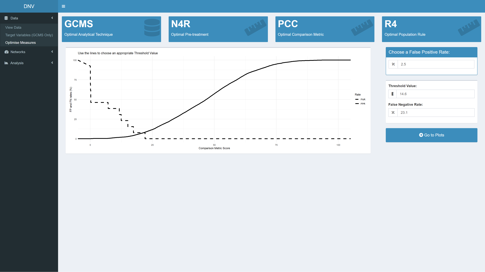
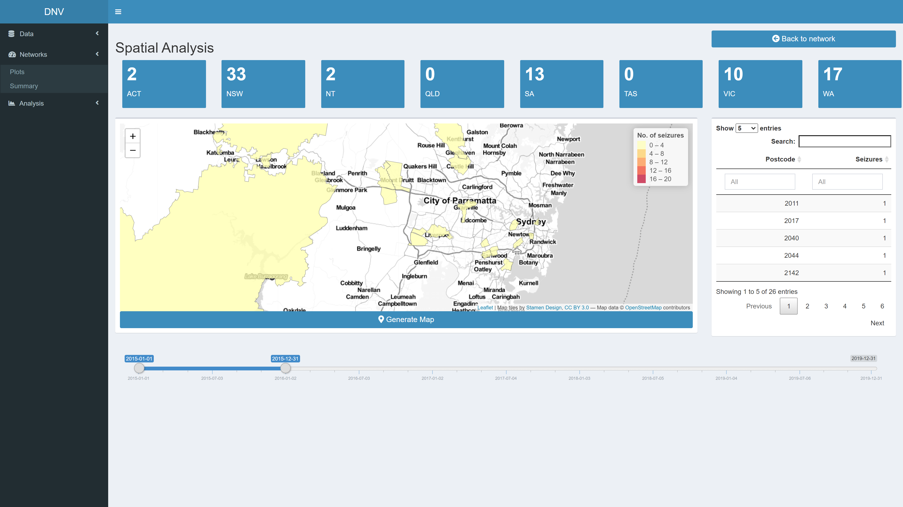

# Dynamic Network Visualisation (DNV)

The DNV is an interactive R Shiny web application for visualising and
analysing patterns in illicit drug markets to provide insights in line
with an intelligence-led policing approach. The app has a dashboard
layout with sections for viewing and optimising data, building network
graphs and conducting relational, temporal, spatial and other
quantitative analyses.

## Table of contents

  - [Shinyapps.io hosting](https://github.com/PopovicAna/Dynamic-Network-Visualisation#Shinyappsio-hosting)
  - [Scope](https://github.com/PopovicAna/Dynamic-Network-Visualisation#Scope)
  - [Usage](https://github.com/PopovicAna/Dynamic-Network-Visualisation#Usage)
      - [Data](https://github.com/PopovicAna/Dynamic-Network-Visualisation#Data)
      - [Networks](https://github.com/PopovicAna/Dynamic-Network-Visualisation#Networks)
      - [Analysis](https://github.com/PopovicAna/Dynamic-Network-Visualisation#Analysis)
  - [Future direction](https://github.com/PopovicAna/Dynamic-Network-Visualisation#Future-direction)
  - [Author](https://github.com/PopovicAna/Dynamic-Network-Visualisation#Author)
  - [Acknowledgements](https://github.com/PopovicAna/Dynamic-Network-Visualisation#Acknowledgements)

## Shinyapps.io hosting

The DNV app can be accessed at
<https://popovicana.shinyapps.io/Dynamic-Network-Visualisation/>

> Note: As the original dataset used in this project is sensitive, a
> simulated dataset has been created for this example.

Please see the gif below for a quick demo (40 sec) of the app.

## Scope

Currently, the types of visualisations created to support
intelligence-led policing are static in nature \[39, 102\]; limiting the
potential of the available information. To create actionable
intelligence, it is important that drug markets and their features can
be viewed and analysed in an interactive and dynamic way.

## Usage

### Data

This section allow users to explore the simulated data and optimise it
in preparation for network visualisation. **For more background
information about the concepts explored in the subsequent subsections
please refer to [this
repository](https://github.com/PopovicAna/Prioritisation-of-analytical-techniques).**

#### View Data

The “View Data” page is the first thing you see when the app is loaded,
see Figure 1. Here you can explore and download the simulated dataset.
The respective code reads in an excel file with four sheets. The first
sheet is a “lookup table” with information about each specimen
(i.e. seizure number, date of seizure, purity, etc.), the other three
sheets relate to different profiles that have been extracted for each
specimen. These profiles have been extracted using several analytical
techniques; gas chromatography-mass spectrometry (GMCS), isotope-ratio
mass spectrometry (IRMS) and capillary electrophoresis (CE).

*Figure 1: Exploring datasets used in this project*

#### Target Variables

This page allows you to reduce any redundant variables in the GCMS
dataset. Not all variables contribute equally to the GCMS specimen
profiles and should be removed if they are deemed to be redundant.
Redundant variables are identified by following the three-fold criteria
on the page. Once these variables have been identified, they can be
unchecked at the bottom of the page, see Figure 2. Clicking the
“calculate optimal measures” button will only keep the checked target
variables for subsequent analysis and also take you to the next page.

*Figure 2: Reducing target variables for a particular dataset*

#### Optimise Measures

At the top of this page are several value boxes displaying optimal
measures; the most discriminatory analytical technique, the optimal
pre-treatment (PT), the optimal comparison metric (CM) and the optimal
population rule (PR). Changing the desired target variables will affect
the output of these value boxes as several PTs, CMs and PRs are tested
across the three profile types (i.e. GCMS, IRMS and CE).

This page also allows users to define an acceptable threshold value
(THV) for determining whether specimens are linked or not; this will
influence how the network plot will look. Essentially, as the THV is
decreased the number of links in the subsequent network plot will be
increased. The THV can be assessed based on false positive (FP) and
false negative (FN) rates of receiver operating characteristic curves,
see Figure 3. In the field of forensic intelligence, a FP rate of 2.5 %
is commonly acceptable. Once an acceptable FPR has been defined, the “Go
to plots” button unsurprisingly takes you to the network plot.

*Figure 3: Defining a threshold value for specimen linkage*

### Networks

This section allows users visualise illicit drug markets and review
important information regarding selected network nodes.

#### Plots

This page allows users to plot networks between specimens and the
clusters they belong to (calculated through hierarchical clustering
analysis). As the clustering is performed on a chemical profiles of the
illicit drug specimens, the resultant clusters are referred to as
chemical classes (CC). Do to the large number of specimens, trying to
plot the relationship between CCs and specimen results in a messy graph.
A cleaner alternative is plotting the relationships between CCs and the
seizure that the specimen came from, see pane B in Figure 4.  

*Figure 4: Relationships between CCs, specimens and seizures*

Figure 5 displays what the generated network plot looks like in the app.
Users may only want to explore networks of illicit drug markets for
specific date ranges or regions. For this reason the network properties
should be specified before the plot is generated. The four boxes at the
bottom of the page are buttons which will navigate you to the respective
analysis page.

*Figure 5: Network plot between specimen seizures (grey circles) and
their respective CCs (black circles)*

#### Summary

As the name suggests this page provides a summary about nodes in the
active network plot, specifically it reacts to the selection of CC nodes
(black circles). Information will be filtered to reflect the date range
slider, regions specifed and CC selected. The information that is
displayed is a subset of the lookup table, the GCMS dataset and a colour
coded correlation matrix showing the similarity between specimens in the
selected CC, please see the gif below for a quick demo (8 sec) of the
summary page.

### Analysis

This section allows users to perform relational, temporal, spatial and
other quantitative analysis on illicit drug markets. **For more
background information about the concepts explored in the subsequent
subsections please refer to [this
repository](https://github.com/PopovicAna/Analysing-illicit-drug-networks).**

#### Relational Analysis

The top of the page contains several value boxes containing network
measures specific to the selected date range, see Figure 6. The bottom
of the page plots the n largest components in the active network. The
number input above the plot controls how many “largest” components are
extracted. A major part of relational analysis is identifying
interesting clusters in the network, for example large components.

*Figure 6: Relational analysis of active network*

#### Temporal Analysis

This page is not reactive to the date range sliders, instead it displays
temporal measures for the entirety of the dataset. In this manner users
can identify peaks in the evolution of drug markets. For example, the
two value boxes in the bottom right corner display information about
mean and median CC life, see Figure 7. Using this information, it would
be worthwile to further investigate CCs that are observed in the network
for a period longer than the mean lifetime.

*Figure 7: Temporal analysis of entire network*

#### Spatial Analysis

The top of the page displays the number of seizures, in the active
network, from each region. The map on the bottom left of the page
displays the postcodes where the seizures occured; the map is reactive
to the date range slider, see Figure 7. The table on the bottom right
summarises all the postcodes in the map and the number of seizures made
in each. Spatial analysis of illicit drug markets is useful in
suggesting where collaboration is needed between jurisdictions.

*Figure 8: Relational analysis of active network*

#### Quantitative Analysis

This page is not reactive to the date range sliders, instead it displays
further quantitative measures for the entirety of the dataset,
specifically relating to specimen purity and precursors. When
quantitative data is available on drug markets, it can be evaluated in a
spatiotemporal manner to analyse features of these markets and their
implications for intelligence-based control measures and drug policy.

*Figure 9: Relational analysis of active network*

## Future direction

  - Allow users to upload their own datasets
  - After adjusting the date range slider, adding colour to new nodes in
    the network plot to inform users
  - Minor layout modifications

## Author

Ana Popovic - [popovicana](https://github.com/PopovicAna)

## Acknowledgements

This project is part of a Australian Research Council grant
(LP160100352)

This application would not be possible without key packages by other
authors in the R community.
