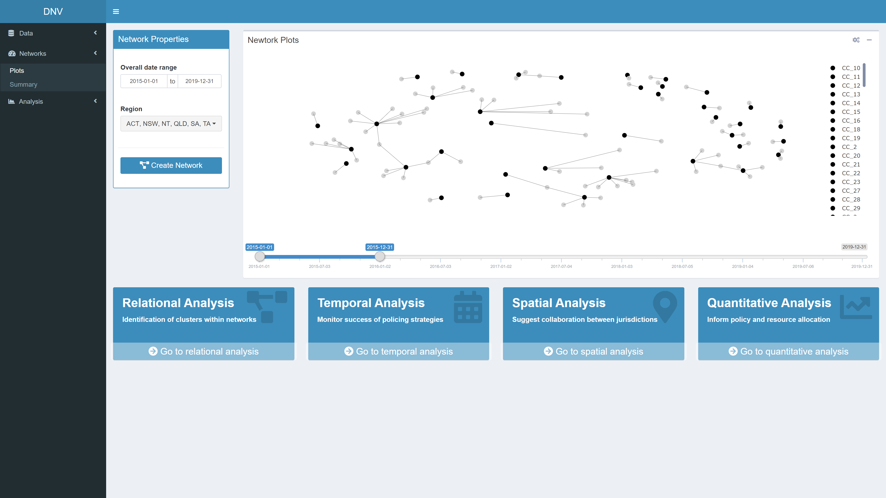
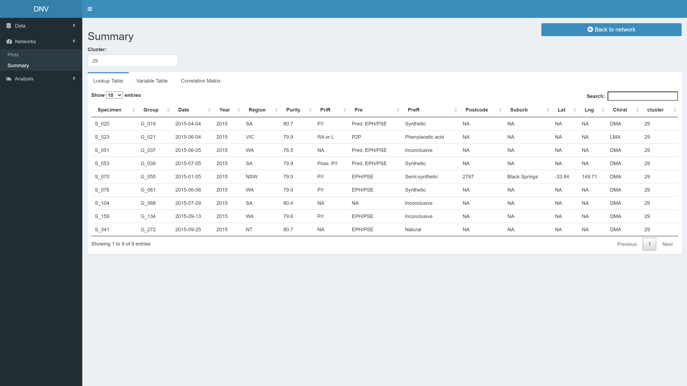
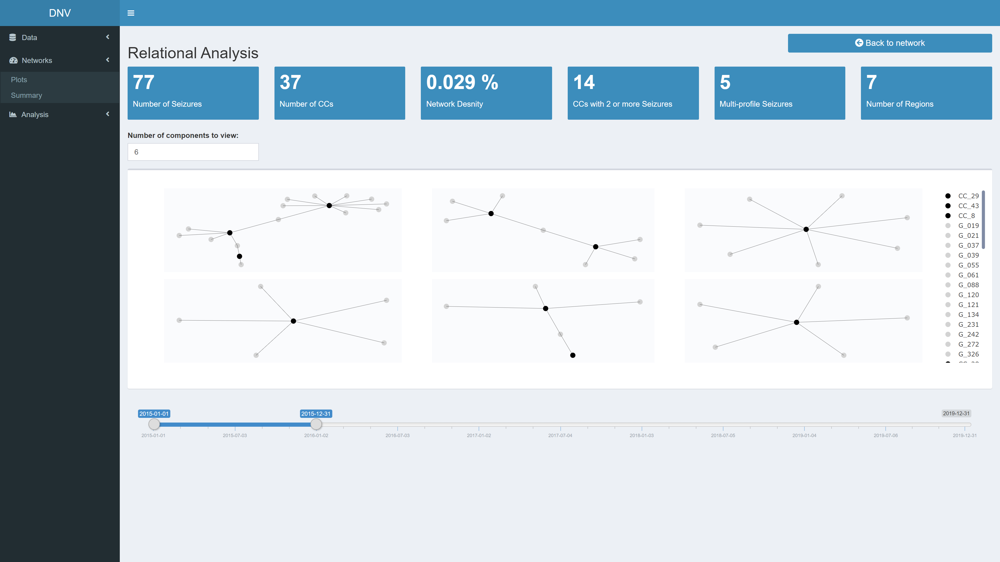
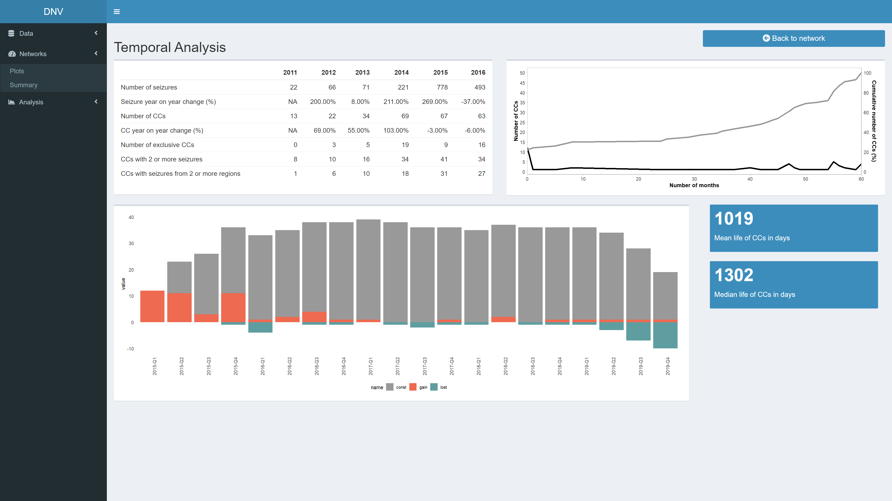

# Dynamic Network Visualisation (DNV)

## App overview
The DNV is an interactive R Shiny web application for visualising and
analysing patterns in illicit drug markets to provide insights in line
with an intelligence-led policing approach. The app has a dashboard
layout with sections for viewing and optimising data, building network
graphs and conducting regarding relational, temporal, spatial and
other quantitative analyses.

*Note: As the original dataset used in this project is sensitive, a
simulated dataset has been created for this example.*

Please see the gif below for a quick demo of the app:

## Shinyapps.io hosting
The DNV app can be accessed at:
<https://popovicana.shinyapps.io/Dynamic-Network-Visualisation/>

## Scope
Currently, the types of visualisations created to support
intelligence-led policing are static in nature \[39, 102\]; limiting the
potential of the available information. To create actionable
intelligence, it is important that drug markets and their features can
be viewed and analysed in an interactive and dynamic way.

## Usage

### View Data
The “View Data” page is the first thing you see when the app is loaded. 
Here you can explore and download the simulated dataset. 

The respective code reads in an excel file with four sheets; the first sheet is a "lookup table" with 

### Target Variables page

This page allows you to reduce any redundant variables in the GCMS
dataset. 

### Optimise Measures page

**For more background information on the significance of prioritising analytical techniques (i.e. choising target variables and optimising measures) please see [this repository](https://github.com/PopovicAna/Prioritisation-of-analytical-techniques).**

### Plots page

### Summary page

### Relational Analysis page

### Temporal Analysis page

### Spatial Analysis page

### Quantitative Analysis page

**For more background information on the significance of strategic level analysis (i.e. relational, temporal, spatial and further quantitative analyses) please see [this repository](https://github.com/PopovicAna/Analysing-illicit-drug-networks).**

## Future direction

Still not finished :O

  - Fix layout

## Author

Ana Popovic - [popovicana](https://github.com/PopovicAna)

## Licence

## Acknowledgements

This project is part of a Australian Research Council grant (number.)

This application would not be possible without key packages by other
authors in the R community, particularly the shiny, shinydashboard, DT
and shinyjs packages. Graph visualisations created with igraph and
visNetwork, and text analysis with support from tm, SnowballC, wordcloud
and syuzhet packages.
